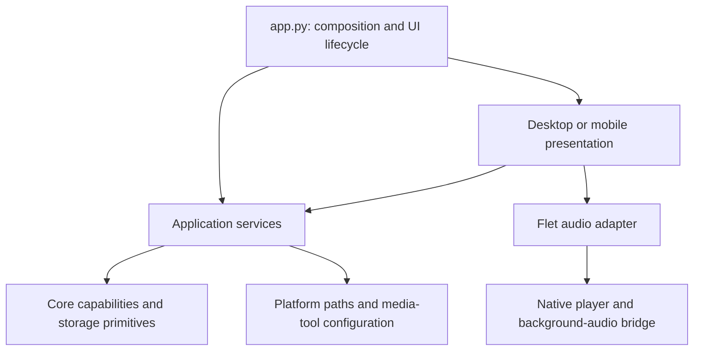

# Architecture and invariants

Melody has a Python application, two Flet presentations, a local Python/Dart
background-audio bridge, native audio players, and an independently selected
runtime yt-dlp wheel. These are separate state owners with explicit handoffs.
Fewer files or fewer lines are not goals if they weaken those boundaries.

## Dependency rules

- `app.py` constructs and connects services. It is the composition root, not a
  second implementation of playback, download, or library behavior.
- `ui/` calls application services and reads application contracts. Track and
  playlist values are re-exported through `application/contracts.py`; they are
  the original core dataclasses, not copies with a second schema.
- `application/` owns use cases that cross capabilities: download-to-library
  registration, history, queue policy, and playback intent. It must not import
  Flet or a presentation. `downloads.py` coordinates jobs; it does not extract,
  convert, or transfer audio itself.
- `core/` owns independently usable capabilities: downloading, library records,
  canonical media identity, bounded worker pools, and filesystem primitives.
  It must not import application services, UI, the composition root, or platform
  configuration. The application injects native media-tool options.
- `platform_runtime.py` and `runtime_environment.py` are infrastructure leaves.
  New platform concerns should have named modules and explicit dependencies;
  they must not become entry points into application services.
- Desktop and mobile implementations cannot import one another. Shared pages
  contain shared presentation behavior; gestures, shell structure, insets, and
  platform-specific controls belong in the corresponding presentation.
- Type-only imports inside `TYPE_CHECKING` do not create runtime dependencies.

`tools/check_architecture.py` runs in the unit suite. It checks absolute and
relative runtime imports, literal dynamic imports, layer direction, opposite
presentation imports, and import cycles. It cannot prove the target of an
arbitrary computed dynamic import; add such imports only with focused tests.

## State ownership

| State | Authority | Other participants |
| --- | --- | --- |
| Requested transport, queue, current selection, progress | `PlaybackController` | UI sends commands; backend reports observations |
| Actual native decoder/device state | Native audio player | Adapter forwards observations to the controller |
| Track UUIDs, file references, hashes, playlists | `MusicManager` | Application services coordinate registration and deletion |
| Settings, enriched track details, history, session queue | `ApplicationStore` | Writes commit atomically; failure restores in-memory values |
| Worker execution, cancellation, staged download files | `Downloader` | Coordinator acknowledges successful handoff |
| Download reuse, registration, retry, durable operation history | `DownloadCoordinator` | Core does not know about the library |
| Runtime yt-dlp selection | Startup updater and its `UpdateResult` | Providers and workers import yt-dlp only after selection |

### Playback and concurrency

The controller is the sole Python transport-state owner. Its `playing` property
is read-only to callers. It represents requested playback while a load or native
command is pending, and is reconciled by native state/error events. It is not
proof that the device has emitted sound. Consumers needing a consistent view
can read the immutable `PlaybackSnapshot`.

Commands, queue mutations, and native callbacks share the controller's reentrant
lock. Background reads use the same lock and a generation counter. Switching a
source or handling an error invalidates an earlier read. Events received while
replacement bytes are loading cannot overwrite the new request. The adapter
rejects events from obsolete native services and handles completion once per
service generation. Callbacks must enqueue UI work or return promptly; do not
wait for another thread that needs the controller lock.

The backend owns transport mechanics, RPC ordering, and native session updates;
it must not advance the queue or maintain a competing application queue.
System media controls call the same controller commands as the visible UI.
Returning from background queries the native player and reconciles observations.
Suspending a page is not a request to stop playback.

Full Android process death or Flet page/service recreation is a distinct case.
The current bridge does not claim durable restoration of a native player's
identity after the Python process is recreated. Implementing that requires a
native session identity/reattachment protocol and device tests, not another
Python `playing` flag. iOS background and lock-screen behavior also requires
device verification. The headless suite cannot certify either lifecycle.

Downloads have a separate bounded worker pool. Coordinator reservations use
canonical source keys under its lock; requests for one source share active
work. Library file allocation, duplicate lookup, and registration are serialized
through `MusicManager.mutation()`, including local imports and download imports.
ApplicationStore serializes each JSON transaction. A data directory is intended
for one application writer; the library is not a multiprocess database.

## Track identity and files

A library UUID is the durable identity of a saved record. Remote identity is
provider plus stable media ID, represented by `MediaIdentity`; these two
identities have different jobs. YouTube watch, short, shortened, live, and embed
URLs normalize to `youtube:<media-id>`. Titles and filenames never determine
remote equality. Local files use a content hash for duplicate detection.
SearchResult exposes remote identity; queue and playlist entries contain library
UUIDs; core Track and application TrackDetails remain the authoritative models
for their respective fields. Free-form yt-dlp dictionaries stop at provider and
download-adapter boundaries. Download coordination still uses an internal
metadata mapping; it is not a second public track model.

| File class | Owner and lifecycle |
| --- | --- |
| Preview stream | Ephemeral URL; does not create a permanent library track |
| Download staging | Core-owned `.melody-download-*` temporary directory; normal failure/cancellation cleans it |
| Completed, unregistered download | Checksum-bearing `.melody-download-<task UUID>.json` receipt owns the handoff |
| Managed library audio | Referenced by `MusicManager`; application deletion checks remaining references |
| Imported local original | Owned by the user; Melody copies it and never deletes the original |
| Copied import staging | `.melody-import-*.tmp`; atomic rename exposes only complete files |
| Uploaded cookies | Private application storage; explicit upload/remove only |
| Runtime wheels | Updater cache, separate from immutable packaged yt-dlp |

Before completed download files are promoted, core writes a durable receipt with
their final basenames, hashes, source, and task identity. A successful application
registration and history commit acknowledge that receipt. Startup verifies and
replays interrupted handoffs. Malformed, missing, or mismatched handoffs remain
for repair rather than silently adopting unrelated files. Core-only download
consumers must acknowledge the receipt after durably accepting its files.

Cancelling is cooperative. A queued worker can be cancelled immediately; an
active yt-dlp operation stops at a progress hook or the next boundary, so a
network call or converter may delay cancellation. Terminal completion and
cancellation are decided under one lock: cancellation accepted before completion
wins, cleans owned outputs, and publishes one cancelled result. Retrying starts
fresh; partial-download resumability is not promised. Forced process termination
can leave staging directories, which are preserved rather than deleted by an
age-based guess while another process might own them.

## Crash consistency and recovery

Settings, library metadata, cookies, update state, and download receipts use
temporary writes, file flush/fsync, atomic replacement, and directory fsync where
supported. Audio promotion happens on the destination filesystem; local imports
copy to a temporary file there first. This avoids partial final files, but cannot
promise durability beyond the filesystem/device's guarantees.

The binary library and JSON state are separate stores, not a distributed
transaction. Startup removes stale secondary references, marks completed history
with missing audio as repairable, replays verified download receipts, and prunes
missing queue files. Missing track records remain available for source-based
repair. Unregistered local files are reported and preserved. A local-import
process kill or a failed deletion can still leave an unregistered file; automatic
deletion without a durable ownership record is deliberately unsupported.

Failure categories are network, authentication/cookies, unavailable media,
extractor incompatibility, rate limit, disk, cancellation, unsupported URL, and
unknown. Core results carry the category and recovery action; download history
persists them. Recovery is user initiated: there is no automatic retry storm.
Rate limits require waiting; cookie failures require refreshed credentials;
storage errors require capacity/permission repair. Provider messages and download
results should use this shared vocabulary as new providers are added.

## Remaining engineering work

- Native session reattachment after process/page recreation and physical-device
  lifecycle tests.
- A complete locked Flutter/native transitive dependency graph for each release
  target; pinning Python packages and bridge dependencies alone is insufficient
  for byte-for-byte reproducible native artifacts.
- Durable deletion/local-import journals if automatic cleanup of their crash
  leftovers is required, and multiprocess locking if simultaneous app writers
  become a supported feature.
- Splitting platform infrastructure by capability when it gains new concerns;
  avoid moving files purely to reduce directory size.
