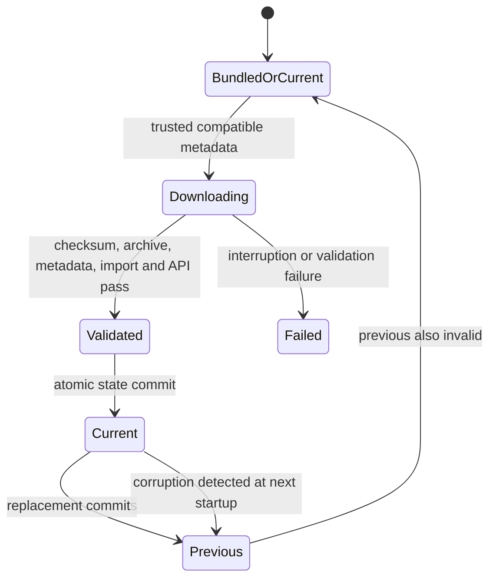

# Release and dependency policy

## One release version

`src/musicplayer/__init__.py::__version__` is authoritative and must match the
release tag being cut. Historical tags are not rewritten. Setuptools reads that
attribute for package metadata; build wrappers read the same literal and pass it
explicitly to Flet's native build version. `tools/release_version.py`
rejects a tag that is not exactly `v<version>` before native builds start.
Artifact names include the version. Manual workflow builds use the same source
version and do not publish a tagged release.

The native build number is `major * 1_000_000 + minor * 1_000 + patch`, with
minor/patch below 1000 and major at most 2099. Every published build needs a new
version; rebuilding the same version does not create a new Android version code.
Before the first store upload under this policy, check any previously uploaded
version codes. The repository has no record of store upload history.

1. Change the one version constant and dependency pins when needed.
2. Refresh `uv.lock`, run validation, and review compatibility changes together.
3. Build through the production wrappers from a clean checkout.
4. Tag exactly `v<version>` to use the release workflow.

Wrappers reject caller-supplied `--build-version` or `--build-number` overrides.
Use canonical POSIX-style exclusions in project configuration; the pinned Flet
packaging adapter generates separator variants at the boundary. Do not duplicate
them throughout the TOML file.

## Flet and bridge compatibility

| Component | Tested baseline in this checkout |
| --- | --- |
| Flet / Flet Audio / Flet Desktop / Flet CLI | 0.86.5, exact Python pins |
| Local flet-background-audio Python/Dart package | 0.1.0 |
| Bridge Dart Flet | 0.86.5, exact |
| Bridge audioplayers / flutter_media_session | 6.6.0 / 3.0.1, exact |
| Bundled yt-dlp fallback | 2026.8.19, exact |

The background-audio package is owned and maintained in this repository. It is
an application dependency resolved from `packages/flet_background_audio` through
`tool.uv.sources` and Flet's dev-package mapping. It is not an independently
supported public distribution. Its `0.1.0` version describes the Python/Dart
bridge protocol, not Melody's application version; keep both package manifests
in agreement when the bridge protocol changes. The Dart package is marked
`publish_to: none`.

Update the Flet family together. A bridge protocol change requires compatible
Python and Dart changes in one review and a bridge version bump. Change Melody's
exact bridge dependency in the same review. Before accepting a compatibility
change, run headless tests, compiled desktop/mobile smoke tests, and native
play/pause/seek/queue/system-controls/lifecycle checks on supported targets.

`uv.lock` freezes the Python resolution; CI uses `uv sync --locked` so stale
metadata fails validation. CI passes the Python version explicitly on every run, so the source-tree `.python-version` cannot silently override its matrix. Native builds also involve Flet's packaging resolver,
Flutter, SDKs, and transitive Dart/native packages. Those artifacts are not
claimed to be bitwise reproducible until their full target-specific inputs and
locks are captured. Signing variables are required before the Android build;
the workflow checks their presence before installing its build dependencies.
No signing credentials belong in source control.

## Runtime yt-dlp selection

The bundled pin is immutable. Runtime wheels are stored under the private app
data directory's `yt-dlp-runtime`; they never replace the bundled distribution.
The accepted update window is `>=2026.8.19,<2027`, defined in the updater. This
is a bounded compatibility policy, not a claim that all upstream behaviors in
that range have been tested. Changing the window requires a reviewed Melody
change and extractor/download regression tests.

Selection finishes before any provider/worker imports yt-dlp. The async startup
entry point prepares once per process, returns one `UpdateResult`, and holds a
session lock for the process lifetime. A second process unable to acquire the
runtime session lock uses its bundled package without changing that cache.
Changing a selected runtime requires a restart; hot-swapping imported modules
is forbidden. Diagnostics should report `UpdateResult.active_version` and
`active_source`, with the bundled/current/previous versions as context.

State schema 2 contains `current`, `previous`, `pending`, and `failed` records.
`current` is the committed active runtime role; an absent current means bundled.
Each wheel record contains version, basename, and SHA-256. `pending.status` is
`downloading` or `validated`; a failed record also contains its reason and may
be retryable after transient I/O failure. Schema 1 current/previous records are
revalidated and migrated. Invalid state never grants trust to directory contents.

Metadata and wheel downloads use HTTPS with size limits. Production wheel URLs
must be on PyPI's file host; yanked wheels are rejected. Wheels must match the
trusted SHA-256, pass ZIP integrity and size/path checks, contain the expected
distribution/version, and satisfy Python and required dependency constraints.
A no-network import/API probe constructs YoutubeDL and checks the interfaces
Melody uses. When a standalone Python executable is available, probes run in an isolated
interpreter with a timeout. Embedded/frozen desktop and Android/iOS hosts probe
during startup in the same interpreter and clean up temporary yt-dlp imports;
they must not try to relaunch the app executable as Python. This embedded probe
has no hard process timeout.

New bytes are written separately and fsynced, then renamed; state is committed
atomically before activation. A `validated` pending transaction can complete on
restart after revalidation. A `downloading` transaction cannot activate its
wheel. Unknown cache wheels are discarded. If current is corrupt or cannot
import, previous is revalidated and promoted; if both fail, the bundle remains
usable. At most current and previous runtime wheels survive successful cleanup.
Cleanup failures are diagnostic and may temporarily leave extra files.

Failed compatibility validation quarantines that version/checksum combination;
a newer candidate can still be considered. Transient download/storage failure
can retry on a later launch. Import/API validation does not detect every future
extractor behavior change. Network or update failures must not prevent the app
from launching with the selected valid fallback.
